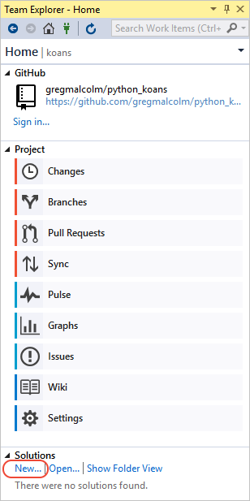
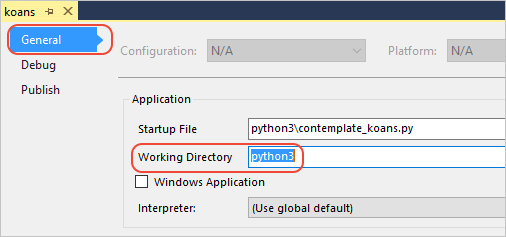
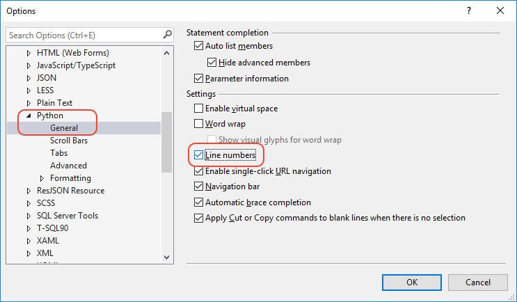

# Quickstart: clone a repository of Python code in Visual Studio

Once you've [installed Python support in Visual Studio 2017](installation.md), you can easily clone a repository of Python code and create a project from it.

[!INCLUDE[install-github-extension](includes/install-github-extension.md)]

2. Launch Visual Studio.

3. Select **View > Team Explorer...** to open the **Team Explorer** window in which you can connect to GitHub or Visual Studio Team Services, or clone a repository.

    

4. In the URL field under **Local Git Repositories**, enter `https://github.com/gregmalcolm/python_koans`, enter a folder for the cloned files, and select **Clone**.

    > [!Tip]
    > The folder you specify in Team Explorer is the specific folder to receive the cloned files. Unlike the `git clone` command, creating a clone in Team Explorer does not automatically create a subfolder with the name of the repository.

5. When cloning is complete, double-click the repository folder at the bottom of Team Explorer to navigate to the repository dashboard. Under **Solutions**, select **New...**.

    

6. In the **New Project** dialog that appears, select "From Existing Python Code", specify a name for the project, set **Location** to the same folder as the repository, and select **OK**. In the wizard that appears, select **Finish**.

7. Select **View > Solution Explorer** from the menu.

8. In Solution Explorer, expand the `python3` node, right-click `contemplate_koans.py`, and select **Set as Startup File**. This step tells Visual Studio which file it should use when running the project.

9. Select **Project > Properties** from the menu, select the **General** tab, and set **Working Directory** to "python3". This is necessary because by default Visual Studio sets the working directory to the project root rather than the location of the startup file (`python3\contemplate_koans.py`, which you can see in the project properties as well). The program code looks for a file `koans.txt` in the working folder, so without changing this value you'll see a runtime error.

    

10. Press Ctrl+F5 or select **Debug > Start Without Debugging** to run the program. If you see a `FileNotFoundError` for `koans.txt`, re-check the working directory setting in the previous step.

11. When the program runs successfully, it displays an assertion error on line 17 of `python3/koans/about_asserts.py`. This is intentional: the program is designed to teach Python by having you correct all the intentional errors. (More details are found on [Ruby Koans](http://rubykoans.com/), which inspired Python Koans.)

    

12. Open `python3/koans/about_asserts.py` by navigating to it in Solution Explorer and double-clicking the file. Notice that line numbers do not appear by default in the editor. To change this, select **Tools > Options**, select **Show all settings** at the bottom of the dialog, then navigate to **Text Editor > Python > General** and select **Line numbers**:

    

13. Correct the error by changing the `False` argument on line 17 to `True`. The line should read as follows:

    ```python
    self.assertTrue(True) # This should be True
    ```

14. Run the program again to see that the first check passes, and the program stops on the next koan. Continue correcting the errors and re-running the program as you want.

> [!Important]
> In this quickstart, you created a direct clone of the *python_koans* repository on GitHub. Such a repository is protected by its author from direct changes, so attempting to commit changes to the repository fails. In practice, developers instead fork such a  repository to their own GitHub account, make changes there, and then create pull requests to submit those changes to the original repository. These steps are described in [Tutorial Step 6 - Working with Git](vs-tutorial-01-06.md).

## Next Steps

> [!div class="nextstepaction"]
> [Tutorial: Working with Python in Visual Studio](vs-tutorial-01-01.md)

## See Also

- [Creating an environment for an existing Python interpreter](python-environments.md#creating-an-environment-for-an-existing-interpreter).
- [Install Python support in Visual Studio 2015 and earlier](installation.md).
- [Install locations](installation.md#install-locations).
